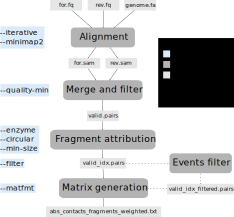

# hicstuff

[](https://badge.fury.io/py/hicstuff)

[](http://bioconda.github.io/recipes/hicstuff/README.html)
[](https://github.com/koszullab/hicstuff/actions/workflows/ci.yml)
[](https://doi.org/10.5281/zenodo.2620608)
[](https://codecov.io/gh/koszullab/hicstuff)
[](https://hicstuff.readthedocs.io)
[](https://github.com/astral-sh/ruff)

A lightweight library that generates and handles Hi-C contact maps in either cooler-compatible 2Dbedgraph or [instaGRAAL](https://github.com/koszullab/instaGRAAL) format. It is essentially a merge of the [yahcp](https://github.com/baudrly/yahcp) pipeline, the [hicstuff](https://github.com/baudrly/hicstuff) library and extra features illustrated in the [3C tutorial](https://github.com/axelcournac/3C_tutorial) and the [DADE pipeline](https://github.com/scovit/dade), all packaged together for extra convenience.

The goal is to make generation and manipulation of Hi-C matrices as simple as possible and work for any organism.

## Table of contents

1. [Table of contents](#table-of-contents)
2. [Installation](#installation)
   1. [pip](#pip)
   2. [Conda](#conda)
   3. [Docker](#docker)
3. [Usage](#usage)
   1. [Full pipeline](#full-pipeline)
   2. [Individual components](#individual-components)
      1. [Digestion of fastq reads](#digestion-of-fastq-reads)
      2. [Iterative alignment](#iterative-alignment)
      3. [Digestion of the genome](#digestion-of-the-genome)
      4. [Filtering of 3C events](#filtering-of-3c-events)
      5. [Viewing the contact map](#viewing-the-contact-map)
   3. [File formats](#file-formats)
   4. [Contributing](#contributing)
   5. [Citation](#citation)

## Installation

### pip

To install a stable version:
```sh
pip install hicstuff
```

or, for the latest development version:

```sh
git clone https://github.com/koszullab/hicstuff.git
cd hicstuff
uv sync --extra dev
```

If `hicstuff` is installed via pip, additional system dependencies such as
`bowtie2`, `bwa`, `minimap2` and `samtools` will be needed. You can install
them as follows on Debian/Ubuntu:

```bash
apt-get install bowtie2 bwa minimap2 samtools libbz2-dev liblzma-dev
```

### Conda

hicstuff is also available on bioconda, which will automatically handle all
dependencies:

```bash
conda install bioconda::hicstuff
```

### Docker

Docker images are automatically built and published to GitHub Container
Registry (GHCR) when releases are tagged:

```bash
docker pull ghcr.io/baudrly/hicstuff:latest
docker pull ghcr.io/baudrly/hicstuff:<version>
```

## Usage

The hicstuff command line interface is composed of multiple subcommands.
You can always get a summary of all available commands by running:

```txt
hicstuff --help

 Usage: hicstuff [OPTIONS] COMMAND [ARGS]...

 Simple Hi-C pipeline for generating and manipulating contact matrices.

╭─ Options ────────────────────────────────────────────────────────────────────────────────────────╮
│ --version      Show the version and exit.                                                        │
│ --help     -h  Show this message and exit.                                                       │
╰──────────────────────────────────────────────────────────────────────────────────────────────────╯
╭─ Alignment ──────────────────────────────────────────────────────────────────────────────────────╮
│ iteralign      Iteratively align reads to a reference genome.                                    │
│ cutsite        Preprocess FASTQ files by cutting reads at religation sites.                      │
╰──────────────────────────────────────────────────────────────────────────────────────────────────╯
╭─ Processing ─────────────────────────────────────────────────────────────────────────────────────╮
│ digest       Digest a genome FASTA into restriction fragments.                                   │
│ filter       Filter spurious Hi-C events (loops and uncuts) from a pairs file.                   │
│ pipeline     Run the full Hi-C pipeline from FASTQ to contact matrix.                            │
╰──────────────────────────────────────────────────────────────────────────────────────────────────╯
╭─ Matrix operations ──────────────────────────────────────────────────────────────────────────────╮
│ rebin           Rebin a Hi-C matrix to a coarser resolution.                                     │
│ subsample       Subsample contacts from a Hi-C matrix.                                           │
│ convert         Convert between Hi-C matrix formats (graal, bg2, cool).                          │
╰──────────────────────────────────────────────────────────────────────────────────────────────────╯
╭─ Analysis & Visualization ───────────────────────────────────────────────────────────────────────╮
│ view             Visualize a Hi-C matrix as a heatmap.                                           │
│ scalogram        Generate a scalogram from a Hi-C contact matrix.                                │
│ distancelaw      Analyse and plot the Hi-C distance law (P(s) curve).                            │
│ missview         Preview unmappable Hi-C bins for a given read length.                           │
│ stats            Extract mapping statistics from a hicstuff pipeline log file.                   │
╰──────────────────────────────────────────────────────────────────────────────────────────────────╯
```

### Full pipeline

All components of the pipeline can be run at once using the `hicstuff pipeline` command.
This allows to generate a contact matrix from reads in a single command.
By default, the output is a `cool` file.

```txt
hicstuff pipeline --help

 Usage: hicstuff pipeline [OPTIONS] INPUT1 [INPUT2]

 Run the full Hi-C pipeline from FASTQ to contact matrix.
 Example — generate a multi-resolution .mcool for Arima Hi-C:


 hicstuff pipeline --enzyme "DpnII,HinfI" --binning 1000 --threads 8 \
     --genome ref.fa R1.fq.gz R2.fq.gz

╭─ Arguments ──────────────────────────────────────────────────────────────────────────────────────╮
│ *  INPUT1  TEXT  [required]                                                                      │
│    INPUT2  TEXT                                                                                  │
╰──────────────────────────────────────────────────────────────────────────────────────────────────╯
╭─ Options ────────────────────────────────────────────────────────────────────────────────────────╮
│ *  --genome              -g  FILE       Reference genome or aligner index. [required]            │
│    --aligner             -a  STR        Aligner: bowtie2, minimap2 or bwa. [default: bowtie2]    │
│    --balancing-args      -B  STR        Extra arguments passed to `cooler balance`.              │
│    --binning             -b  INT        Bin the cool matrix to this resolution (bp). 0 means no  │
│                                         binning. [default: 0]                                    │
│    --centromeres         -c  FILE       Centromere positions file.                               │
│    --circular            -C             Genome is circular.                                      │
│    --distance-law        -d             Generate a distance law output file.                     │
│    --duplicates          -D             Filter PCR duplicates.                                   │
│    --enzyme              -e  {STR|INT}  Restriction enzyme name, 'mnase'/'dnase', or chunk size  │
│                                         in bp. [default: 5000]                                   │
│    --exclude             -E  STR        Comma-separated chromosomes to exclude (e.g. chrM,2u).   │
│    --filter              -f             Filter spurious 3C events (loops and uncuts).            │
│    --force               -F             Overwrite existing output files.                         │
│    --mapping             -m  STR        Mapping mode. [default: normal]                          │
│    --matfmt              -M  STR        Output matrix format. [default: cool]                    │
│    --no-cleanup          -n             Keep intermediary files.                                 │
│    --outdir              -o  DIR        Output directory (default: current directory).           │
│    --plot                -p             Generate plots at pipeline steps.                        │
│    --prefix              -P  STR        Prefix for all output files.                             │
│    --quality-min         -q  INT        Minimum mapping quality. [default: 30]                   │
│    --remove-centromeres  -r  INT        kb to remove around centromere positions. [default: 0]   │
│    --read-len            -R  INT        Maximum read length (estimated from first read if        │
│                                         omitted).                                                │
│    --size                -s  INT        Minimum contig size threshold. [default: 0]              │
│    --start-stage         -S  STR        Pipeline start stage. [default: fastq]                   │
│    --threads             -t  INT        Number of parallel threads. [default: 1]                 │
│    --tmpdir              -T  DIR        Temporary directory.                                     │
│    --zoomify             -z  BOOL       Generate multi-resolution .mcool from the binned cool    │
│                                         matrix. [default: True]                                  │
│    --help                -h             Show this message and exit.                              │
╰──────────────────────────────────────────────────────────────────────────────────────────────────╯
```

For example, to run the pipeline with `minimap2` using 8 threads and save output
files to the directory `out`:

```sh
hicstuff pipeline -t 8 -a minimap2 -e DpnII -o out/ -g genome.fa reads_for.fq reads_rev.fq
```

If you have already aligned your reads, hicstuff pipeline can also take bam files as input. For example,
to generate a matrix in mcool file with multiple resolutions starting from 5kb, you can run:

```sh
# Note the bam files have to be name-sorted, this can be done using samtools
samtools sort -n aligned_for.bam -o namesorted_for.bam
samtools sort -n aligned_rev.bam -o namesorted_rev.bam
hicstuff pipeline -S bam -b 5000 -o out/ -g genome.fa namesorted_for.bam namesorted_rev.bam
```

The general steps of the pipeline are as follows:



### Individual components

For more advanced usage, different scripts can be used independently on the command line to perform individual parts of the pipeline. This readme contains quick descriptions and example usages. To obtain detailed instructions on any subcommand, one can use `hicstuff <subcommand> --help`.

#### Digestion of fastq reads

Generates new gzipped fastq files from original fastq. The function will cut the reads at their religation sites and creates new pairs of reads with the different fragments obtained after cutting at the digestion sites.

```
hicstuff cutsite --help

 Usage: hicstuff cutsite [OPTIONS]

 Preprocess FASTQ files by cutting reads at religation sites.
 Generates gzipped FASTQ files with reads cut at ligation junctions, creating new fragment pairs
 for mapping.

╭─ Options ────────────────────────────────────────────────────────────────────────────────────────╮
│ *  --forward    -F  FILE  Forward reads FASTQ file. [required]                                   │
│ *  --reverse    -R  FILE  Reverse reads FASTQ file. [required]                                   │
│ *  --prefix     -p  STR   Output prefix (suffixed with _R1.fq.gz / _R2.fq.gz). [required]        │
│ *  --enzyme     -e  STR   Comma-separated restriction enzyme(s). [required]                      │
│    --mode       -m  STR   Fragment pairing mode. [default: for_vs_rev]                           │
│    --seed-size  -s  INT   Minimum read size after cutting. [default: 20]                         │
│    --threads    -t  INT   Number of parallel threads. [default: 1]                               │
│    --help       -h        Show this message and exit.                                            │
╰──────────────────────────────────────────────────────────────────────────────────────────────────╯
```

#### Iterative alignment

Truncate reads from a fastq file to 20 basepairs and iteratively extend and re-align the unmapped reads to optimize the proportion of uniquely aligned reads in a 3C library.

```
hicstuff iteralign --help

 Usage: hicstuff iteralign [OPTIONS] READS_FQ

 Iteratively align reads to a reference genome.
 Truncates reads to 20 bp then iteratively extends and re-aligns unmapped reads to maximise the
 proportion of uniquely aligned reads in a 3C library.

╭─ Arguments ──────────────────────────────────────────────────────────────────────────────────────╮
│ *  READS_FQ  TEXT  [required]                                                                    │
╰──────────────────────────────────────────────────────────────────────────────────────────────────╯
╭─ Options ────────────────────────────────────────────────────────────────────────────────────────╮
│ *  --genome    -g  FILE  Reference genome or aligner index path. [required]                      │
│ *  --out-bam   -o  FILE  Output BAM file path. [required]                                        │
│    --threads   -t  INT   Number of parallel threads. [default: 1]                                │
│    --tempdir   -T  DIR   Temporary directory (default: current directory).                       │
│    --aligner   -a  STR   Aligner: bowtie2, minimap2 or bwa. [default: bowtie2]                   │
│    --min-len   -l  INT   Minimum truncated read length. [default: 20]                            │
│    --read-len  -R  INT   Maximum read length (estimated from first read if omitted).             │
│    --help      -h        Show this message and exit.                                             │
╰──────────────────────────────────────────────────────────────────────────────────────────────────╯
```

#### Digestion of the genome

Digests a fasta file into fragments based on a restriction enzyme or a
fixed chunk size. Generates two output files into the target directory
named "info_contigs.txt" and "fragments_list.txt"

```
hicstuff digest --help

 Usage: hicstuff digest [OPTIONS] FASTA

 Digest a genome FASTA into restriction fragments.
 Writes ``fragments_list.txt`` and ``info_contigs.txt`` to the output directory.

╭─ Arguments ──────────────────────────────────────────────────────────────────────────────────────╮
│ *  FASTA  TEXT  [required]                                                                       │
╰──────────────────────────────────────────────────────────────────────────────────────────────────╯
╭─ Options ────────────────────────────────────────────────────────────────────────────────────────╮
│ *  --enzyme    -e  ENZ[,ENZ2,...]  Restriction enzyme name(s) or fixed chunk size in bp.         │
│                                    [required]                                                    │
│    --outdir    -o  DIR             Output directory (default: current directory).                │
│    --size      -s  INT             Minimum fragment size to keep. [default: 0]                   │
│    --circular  -c                  Genome is circular.                                           │
│    --plot      -p                  Show fragment length distribution histogram.                  │
│    --figdir    -f  DIR             Directory to save the distribution figure.                    │
│    --force     -F                  Overwrite existing output directory.                          │
│    --help      -h                  Show this message and exit.                                   │
╰──────────────────────────────────────────────────────────────────────────────────────────────────╯
```

 For example, to digest the yeast genome with MaeII and HinfI and show histogram of fragment lengths:

```sh
hicstuff digest --plot --outdir output_dir --enzyme MaeII,HinfI Sc_ref.fa
```

#### Filtering of 3C events

Filters spurious 3C events such as loops and uncuts from the library based on a minimum distance threshold automatically estimated from the library by default. Can also plot 3C library statistics. This module takes a pairs file with 9 columns as input (readID, chr1, pos1, chr2, pos2, strand1, strand2, frag1, frag2) and filters it.

```
hicstuff filter --help

 Usage: hicstuff filter [OPTIONS] INPUT_PAIRS OUTPUT_PAIRS

 Filter spurious Hi-C events (loops and uncuts) from a pairs file.

╭─ Arguments ──────────────────────────────────────────────────────────────────────────────────────╮
│ *  INPUT_PAIRS   TEXT  [required]                                                                │
│ *  OUTPUT_PAIRS  TEXT  [required]                                                                │
╰──────────────────────────────────────────────────────────────────────────────────────────────────╯
╭─ Options ────────────────────────────────────────────────────────────────────────────────────────╮
│ --figdir       -f  DIR      Directory for output figures.                                        │
│ --interactive  -i           Ask for thresholds interactively after showing plots.                │
│ --plot         -p           Show library composition and 3C event abundance plots.               │
│ --prefix       -P  STR      Library name displayed on figures.                                   │
│ --thresholds   -t  INT-INT  Manual thresholds as UNCUT-LOOP (e.g. 4-5).                          │
│ --help         -h           Show this message and exit.                                          │
╰──────────────────────────────────────────────────────────────────────────────────────────────────╯
```

#### Viewing the contact map

Visualize a Hi-C matrix file as a heatmap of contact frequencies. Allows to
tune visualisation by binning and normalizing the matrix, and to save the
output image to disk. If no output is specified, the output is displayed.

```
hicstuff view --help

 Usage: hicstuff view [OPTIONS] CONTACT_MAP [CONTACT_MAP2]

 Visualize a Hi-C matrix as a heatmap.

╭─ Arguments ──────────────────────────────────────────────────────────────────────────────────────╮
│ *  CONTACT_MAP   TEXT  [required]                                                                │
│    CONTACT_MAP2  TEXT                                                                            │
╰──────────────────────────────────────────────────────────────────────────────────────────────────╯
╭─ Options ────────────────────────────────────────────────────────────────────────────────────────╮
│ --binning    -b  INT[bp|kb|Mb]  Merge bins by factor or generate fixed-size bins. [default: 1]   │
│ --cmap       -c  STR            Matplotlib colormap name. [default: Reds]                        │
│ --circular   -C                 Genome is circular.                                              │
│ --despeckle  -d                 Remove speckle artefacts.                                        │
│ --dpi        -D  INT            Output image DPI. [default: 300]                                 │
│ --frags      -f  FILE           fragments_list.txt (required for bp binning and --lines).        │
│ --transform  -T  STR            Pixel transform: log2, log10, ln, sqrt, exp<val>.                │
│ --lines      -l                 Draw chromosome separator lines (requires --frags).              │
│ --max        -M  NUM[%]         Colorscale maximum (percentile with %). [default: 99%]           │
│ --min        -m  NUM[%]         Colorscale minimum. [default: 0]                                 │
│ --n-mad      -N  FLOAT          MAD threshold for ICE normalization bin filtering. [default:     │
│                                 3.0]                                                             │
│ --normalize  -n                 Perform ICE normalization before rendering.                      │
│ --output     -o  FILE           Output image path (display interactively if omitted).            │
│ --region     -r  STR[;STR]      UCSC region to zoom into (e.g. chr1:1000-12000).                 │
│ --trim       -t  FLOAT          Trim bins deviating by more than this many MADs.                 │
│ --help       -h                 Show this message and exit.                                      │
╰──────────────────────────────────────────────────────────────────────────────────────────────────╯
```

For example, to view a 1Mb region of chromosome 1 from a full genome Hi-C matrix rebinned at 10kb:

```sh
hicstuff view --normalize --binning 10kb --region chr1:10,000,000-11,000,000 --frags fragments_list.txt contact_map.tsv
```

### File formats

* `pairs` files: This format is used for all intermediate files in the pipeline and is also used by `hicstuff filter`. It is a tab-separated format holding informations about Hi-C pairs. It has an [official specification](https://github.com/4dn-dcic/pairix/blob/master/pairs_format_specification.md) defined by the 4D Nucleome data coordination and integration center.
* `bedgraph2` bedgraph: This is an optional output format of `hicstuff pipeline` for the sparse matrix. It has two fragment per line, and the number of times they are found together. It has the following fields: **chr1, start1, end1, chr2, start2, end2, occurences**
    - Those files can be [loaded by cooler](https://cooler.readthedocs.io/en/latest/cli.html?highlight=load#cooler-load) using `cooler load -f bg2 <chrom.sizes>:<binsize> in.bg2.gz out.cool` where `chrom.sizes` is a tab delimited file with chromosome names and length on each line, and binsize is the size of bins in the matrix.
* `GRAAL` sparse matrix: This is a simple tab-separated file with 3 columns: **frag1, frag2, contacts**. The id columns correspond to the absolute id of the restriction fragments (0-indexed). The first row is a header containing the number of rows, number of columns and number of nonzero entries in the matrix. Example:

```
564	564	6978
0	0	3
1	2	4
1	3	3
```

* `fragments_list.txt`: This tab separated file provides information about restriction fragments positions, size and GC content. Note the coordinates are 0 point basepairs, unlike the pairs format, which has 1 point basepairs. Example:
   - id: 1 based restriction fragment index within chromosome.
   - chrom: Chromosome identifier. Order should be the same as in info_contigs.txt or pairs files.
   - start_pos: 0-based start of fragment, in base pairs.
   - end_pos: 0-based end of fragment, in base pairs.
   - size: Size of fragment, in base pairs.
   - gc_content: Proportion of G and C nucleotide in the fragment.

```
id	chrom	start_pos	end_pos	size	gc_content
1	seq1	0	21	21	0.5238095238095238
2	seq1	21	80	59	0.576271186440678
3	seq1	80	328	248	0.5201612903225806
```

* `info_contigs.txt`: This tab separated file gives information on contigs, such as number of restriction fragments and size. Example:
   - contig: Chromosome identified. Order should be the same in pairs files or fragments_list.txt.
   - length: Chromosome length, in base pairs.
   - n_frags: Number of restriction fragments in chromosome.
   - cumul_length: Cumulative length of previous chromosome, in base pairs.

```
contig	length	n_frags	cumul_length
seq1	60000	409	0
seq2	20000	155	409
```

### Contributing

All contributions are welcome, in the form of bug reports, suggestions, documentation or pull requests.
We use the [numpy standard](https://numpydoc.readthedocs.io/en/latest/format.html) for docstrings when documenting functions.

The code formatting standard we use is [ruff](https://github.com/astral-sh/ruff) (line-length 100). We use `pytest` as our testing framework. Ideally, new functions should have associated unit tests, placed in the `tests` folder.
To test the code, you can run:

```bash
uv run pytest tests/
```

To lint and format:

```bash
uv run ruff check src/
uv run ruff format src/
```

### Citation

Please cite hicstuff using the official DOI as follows:

Cyril Matthey-Doret, Lyam Baudry, Amaury Bignaud, Axel Cournac, Remi-Montagne, Nadège Guiglielmoni, Théo Foutel Rodier and Vittore F. Scolari. 2020. hicstuff: Simple library/pipeline to generate and handle Hi-C data . Zenodo. http://doi.org/10.5281/zenodo.4066363

Bibtex entry:

```
@software{cyril_matthey_doret_2020_4066351,
  author       = {Cyril Matthey-Doret and
                  Lyam Baudry and
                  Amaury Bignaud and
                  Axel Cournac and
                  Remi-Montagne and
                  Nadège Guiglielmoni and
                  Théo Foutel-Rodier and
                  Vittore F. Scolari},
  title        = {hicstuff: Simple library/pipeline to generate and handle Hi-C data },
  month        = oct,
  year         = 2020,
  publisher    = {Zenodo},
  version      = {v2.3.1},
  doi          = {10.5281/zenodo.4066351},
  url          = {http://doi.org/10.5281/zenodo.4066363}
}
```
